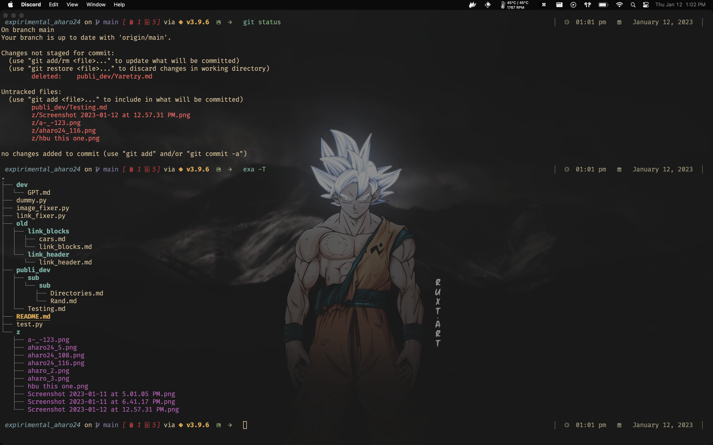

<h1 align="center"><b> Angel J. Haro 


</h1>

<!-- START  -->
<div align="center">
<a href="https://aharoj.io"></a>&nbsp;
<a href="https://discord.gg/HDDQ6pUMHt"></a>&nbsp;
<a href="https://twitter.com/aharoJ"></a>&nbsp;
<a href="https://www.linkedin.com/in/aharoJ/"></a>&nbsp;
<a href="https://leetcode.com/aharoJ/"></a>&nbsp;
<br/>
</div>  
<!-- END -->

<h1 align="center"> <a href=https://aharoj.io> Visit Portfolio </a> </h1>


# dot-starship
This is my custom starship.toml config file, designed to enhance the appearance of my command line prompt. I spent hours researching colors that are appealing to programmers and hand-picking the hacked icons to create a visually pleasing and functional prompt. Each module has been carefully configured to suit my needs, and I've added personal touches like custom symbols for success and error messages. I hope you find it useful!


visual flags, icons
`[save][->]` green 
`[re-do][<-]` red 


# Requirement
...Step 1:
	Install `Homebrew`
```brew
/bin/bash -c "$(curl -fsSL https://raw.githubusercontent.com/Homebrew/install/HEAD/install.sh)"
```

...Step 2:
### [install any type of hacked fonts](https://www.nerdfonts.com/font-downloads)


...`optional but STRONGLY recommended`
- ### [alacritty](https://github.com/aharo24/dot-alacritty)
- ### [vivaldi](https://github.com/aharo24/dot-vivaldi)


# Installation with Homebrew
.
.
.
Step 1
Install starship: 
``` brew
brew install starship
```
.
.
.
Step 2 
Copy file:
my file to  `~/.config/starship.toml

### [my starship file](https://github.com/aharo24/dot-starship/blob/main/resources/aharo24-starship.toml)
.
.
.
Step 3
quickly configure your own shell:

### [configure your shell](https://starship.rs/guide/#step-2-setup-your-shell-to-use-starship)

#### quick examples 
ie...(fish)
Add the following to the end of `~/.config/fish/config.fish`
``` fish
starship init fish | source
```

ie...(zsh)
Add the following to the end of `~/.zshrc`:
``` zsh
eval "$(starship init zsh)"
```


### Shell Support
(I use [fish shell](https://fishshell.com/))

- Bash
- Cmd
- Elvish
- Fish
- Ion
- Nushell
- PowerShell
- Tcsh
- Xonsh
- Zsh


# [dotfiles](https://github.com/aharo24/opensource/tree/main/dotfiles)
- Please 
	- be patient (slowly merging all dotfiles for public use)

- [alacritty  ✅](https://github.com/aharo24/dot-alacritty)
- done
- exa
- fish-abbreviation-tips
- fish
- flameshot
- keycastr 
- obsidian
- raycast
- rectangle
- spunge
- [starship  ✅](https://github.com/aharo24/dot-starship)
- sublime
- tmux
- [vivaldi  ✅](https://github.com/aharo24/dot-vivaldi)
- z


# [Contact Info](https://github.com/aharo24/opensource)

Feel free to follow me on twitter: [@aharo24](https://www.twitter.com/aharo24)!

email me with any questions, improvements, bugs, or just to chat.
io.aharo24@gmail.com


