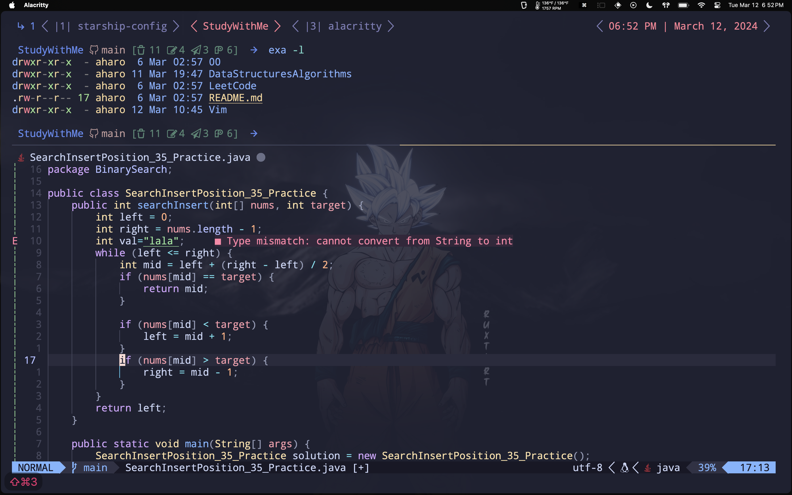
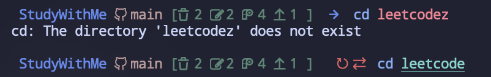

<h1 align="center"><b> Angel J. Haro 


</h1>

<!-- START  -->
<div align="center">
<a href="https://aharoj.io"></a>&nbsp;
<a href="https://discord.gg/HDDQ6pUMHt"></a>&nbsp;
<a href="https://twitter.com/aharoJ"></a>&nbsp;
<a href="https://www.linkedin.com/in/aharoJ/"></a>&nbsp;
<a href="https://leetcode.com/aharoJ/"></a>&nbsp;
<br/>
</div>  
<!-- END -->

<h1 align="center"> <a href=https://aharoj.io> Visit Portfolio </a> </h1>


# dot-starship
This is my custom starship.toml config file, designed to enhance the appearance of my command line prompt. I spent hours researching colors that are appealing to programmers and hand-picking the hacked icons to create a visually pleasing and functional prompt. Each module has been carefully configured to suit my needs, and I've added personal touches like custom symbols for success and error messages. I hope you find it useful!

> OverView 



> visual flags with icons
- [save][->] green 
- [re-do][<-] red 



> new icons | coloschme


--- 

## Quick Guide
### Step 0: Install `Homebrew`


```brew
/bin/bash -c "$(curl -fsSL https://raw.githubusercontent.com/Homebrew/install/HEAD/install.sh)"
```

> skip if already installed

### Step 1: Install starship


``` brew
brew install starship
```

### Step 2: Copy File  
> Copy file into your ~/.config/starship/starship.toml:

#### [my starship file](https://github.com/aharoJ/starship-config/blob/main/starship.toml)


### Step 3: Configure your own shell
[I use Fish Shell](https://fishshell.com)

- #### [configure your shell](https://starship.rs/guide/#%F0%9F%9A%80-installation)

### Step 4: Install Hacked Nerd Font
- ### [install hacked fonts](https://www.nerdfonts.com/font-downloads)


## Recommended Configurations
- ### Alacritty
- ### Tmux 
- ### Fish Shell
> Currently Updating my dot-files


--- 

### DEV DOCS 
#### Current Version
- please integrate **TMUX** to have the full experience
- script clean up with `active` && `non-active` toml scripts

#### Version 0.0.1
- Timer - Colors 
- All Icons for All Languages


#### Version 0.0.2
- A more sutle and simplistic version to pair with **TMUX**
- Removed Timer
- Remove most Icons 
- Remove most Language Icon Support
    - If you want to keep do `disabled = false` 
- Removed Battery
